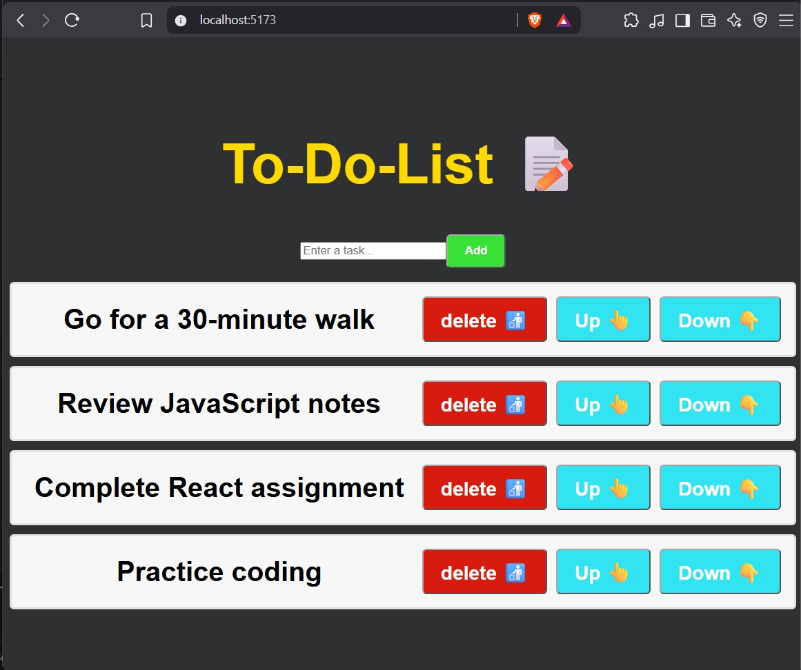

# 📝 React To-Do List

A simple React To-Do List project demonstrating how to manage **array state**, handle user input, add and delete tasks, and change the order of tasks using React's `useState()` Hook.

## 📌 Overview

This project allows the user to:

* ➕ Add new tasks
* 🗑️ Delete tasks
* 👆 Move tasks up
* 👇 Move tasks down
* 📋 Display tasks dynamically
* ⌨️ Enter tasks using a controlled input

The tasks are stored in a React state array and the UI updates automatically whenever the task list changes.

## 🛠️ Technologies Used

* React
* JavaScript
* JSX
* React `useState` Hook
* CSS
* Vite

## 📂 Project Structure

```text
src/
├── App.jsx
├── ToDoList.jsx
├── main.jsx
└── index.css

ScreenShot.jpg
```

## 🖥️ Screenshot

The project screenshot is included in the main folder:

```text
ScreenShot.jpg
```



## 📋 Initial Tasks

The project starts with four tasks:

```jsx
const [tasks, setTasks] = useState([
    "Go for a 30-minute walk",
    "Review JavaScript notes",
    "Complete React assignment",
    "Practice coding"
]);
```

The tasks are stored inside an array using `useState()`.

## ⌨️ Handling User Input

A separate state variable stores the value entered into the input:

```jsx
const [newtask, setNewTask] = useState("");
```

The `onChange` event updates the state whenever the user types:

```jsx
function handleInputChange(event) {
    setNewTask(event.target.value);
}
```

The input is therefore a **controlled component**.

## ➕ Adding a Task

The `addTask()` function adds a new task to the existing array:

```jsx
function addTask() {
    if (newtask.trim() !== "") {
        setTasks(t => [...t, newtask]);
        setNewTask("");
    }
}
```

### Why use `...t`?

The spread operator copies the existing tasks into a new array before adding the new task.

```jsx
setTasks(t => [...t, newtask]);
```

This keeps all existing tasks and adds the new task at the end.

The `trim()` check also prevents empty tasks from being added.

## 🗑️ Deleting a Task

The `deleteTask()` function removes a task using `filter()`:

```jsx
function deleteTask(index) {
    const updatedTask = tasks.filter((_, i) => i !== index);
    setTasks(updatedTask);
}
```

The selected task's index is excluded from the new array.

## 👆 Moving a Task Up

The `moveTaskUp()` function swaps a task with the task directly above it:

```jsx
function moveTaskUp(index) {
    if (index > 0) {
        const updatedTasks = [...tasks];

        [updatedTasks[index], updatedTasks[index - 1]] =
            [updatedTasks[index - 1], updatedTasks[index]];

        setTasks(updatedTasks);
    }
}
```

The `index > 0` check prevents the first task from being moved above the beginning of the list.

## 👇 Moving a Task Down

The `moveTaskDown()` function swaps a task with the task directly below it:

```jsx
function moveTaskDown(index) {
    if (index < tasks.length - 1) {
        const updatedTasks = [...tasks];

        [updatedTasks[index], updatedTasks[index + 1]] =
            [updatedTasks[index + 1], updatedTasks[index]];

        setTasks(updatedTasks);
    }
}
```

The `index < tasks.length - 1` check prevents the last task from being moved beyond the end of the list.

## 🔄 Displaying Tasks

The `map()` method is used to display every task:

```jsx
{tasks.map((task, index) =>
    <li key={index}>
        <span className="text">{task}</span>
    </li>
)}
```

Each task is displayed inside an ordered list.

The `index` is also passed to the delete, up, and down functions:

```jsx
onClick={() => deleteTask(index)}
```

```jsx
onClick={() => moveTaskUp(index)}
```

```jsx
onClick={() => moveTaskDown(index)}
```

## 🎨 Styling

The project uses CSS to create a dark background with a colorful To-Do List interface.

Different buttons have different colors:

* 🟢 **Add** — adds a new task
* 🔴 **Delete** — removes a task
* 🔵 **Up / Down** — changes task order

The CSS also includes hover effects and transitions for the buttons.

## 🧠 Main Concepts

This project combines several React concepts:

```text
useState()
    ↓
Array State
    ↓
Controlled Input
    ↓
Add Task
    ↓
Delete Task
    ↓
Move Task Up / Down
    ↓
map() → Display Tasks
    ↓
React Re-renders the UI
```

### Important Patterns

Adding an item:

```jsx
setTasks(t => [...t, newtask]);
```

Removing an item:

```jsx
setTasks(tasks.filter((_, i) => i !== index));
```

Creating a copy before changing the array:

```jsx
const updatedTasks = [...tasks];
```

Swapping two array elements:

```jsx
[updatedTasks[index], updatedTasks[index - 1]] =
    [updatedTasks[index - 1], updatedTasks[index]];
```

## 📚 What I Learned

* Using `useState()` with arrays
* Managing controlled input components
* Handling `onChange`
* Adding items to an array state
* Removing items using `filter()`
* Using the spread operator to copy arrays
* Displaying array data using `map()`
* Passing indexes to event handlers
* Moving items within an array
* Swapping array elements
* Updating state and triggering React re-renders
* Preventing empty tasks using `trim()`
* Applying CSS styling and hover effects

## 🚀 Running the Project

Install the dependencies:

```bash
npm install
```

Start the development server:

```bash
npm run dev
```

Then open the local URL shown by Vite in your browser.

---

⭐ **This project is a practical example of managing and modifying array state in React by building a functional To-Do List.**
